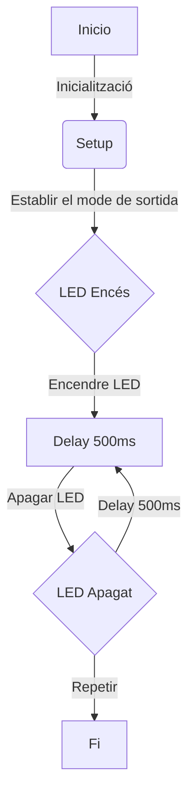
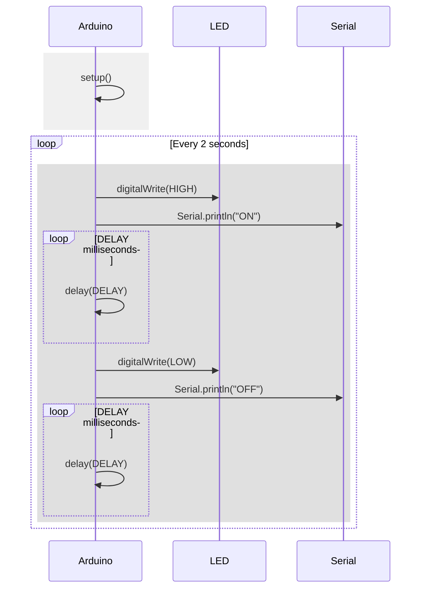

# 1. Codi basic:
Aquest codi defineix un LED incorporat com a pin 2 i estableix un retard de 500 mil·lisegons. En el bucle principal, encén i apaga el LED amb el retard especificat, creant un patró intermitent d'encès i apagat.

```c++
#define LED_BUILTIN 2
#define DELAY 500

void setup() {
 pinMode(LED_BUILTIN, OUTPUT);
}
void loop() {
 digitalWrite(LED_BUILTIN, HIGH);
 delay(DELAY);
 digitalWrite(LED_BUILTIN, LOW);
 delay(DELAY);
}

```
# 2. Diagrama de flux
Aquest diagrama de flux il·lustra el funcionament del codi. Comença amb la inicialització i la configuració del mode de sortida al setup. Després, encén i apaga el LED en un patró determinat amb retards i repeteix aquest procés fins al final.



# 3. Diagrama de temps
Aquest diagrama de temps mostra la seqüència d'activitats del codi amb intervals de temps. Inicia amb la inicialització al setup, i en el bucle principal, encén i apaga el LED, enviant també missatges "ON" i "OFF" pel port sèrie, repetint aquest cicle cada 2 segons.



# 

