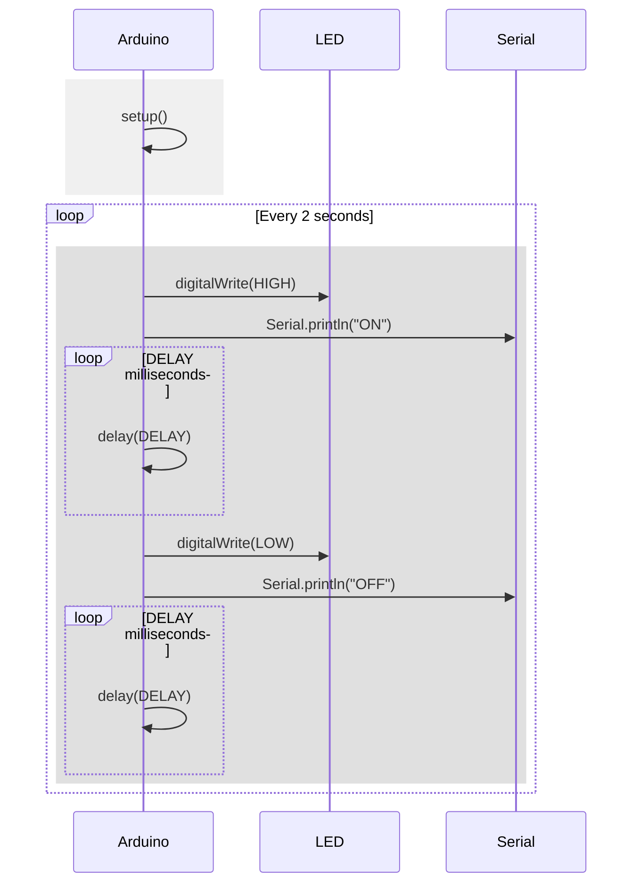

#Diagrama de temps

```mermaid
sequenceDiagram
    participant Arduino
    participant LED
    participant Serial

    rect rgb(240, 240, 240)
        Arduino->>Arduino: setup()
    end

    loop Every 2 seconds
        rect rgb(224, 224, 224)
            Arduino->>LED: digitalWrite(HIGH)
            Arduino->>Serial: Serial.println("ON")
            loop DELAY milliseconds
                Arduino->>Arduino: delay(DELAY)
            end
            Arduino->>LED: digitalWrite(LOW)
            Arduino->>Serial: Serial.println("OFF")
            loop DELAY milliseconds
                Arduino->>Arduino: delay(DELAY)
            end
        end
    end
```

#

